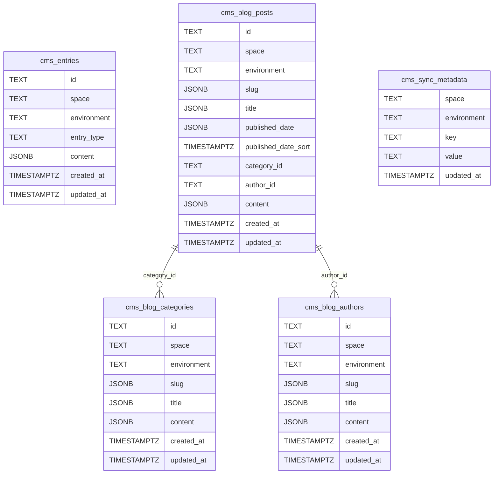

# Database Schema Documentation

This document describes the database schema for the CMS Server. The schema uses PostgreSQL and is managed through migrations located in `src/migrations/`.

## Database Schema Diagram

## Tables Overview

The database contains five tables:

1. **`cms_entries`** - Generic cache for any Contentful Entry or Asset not covered by dedicated blog tables.
2. **`cms_blog_posts`** - Blog posts with denormalized columns for filtering by category/author and sorting by published date.
3. **`cms_blog_categories`** - Blog categories with localized slug and title.
4. **`cms_blog_authors`** - Blog authors with localized slug and title.
5. **`cms_sync_metadata`** - Key-value metadata for sync tracking (e.g. last-sync timestamp).

## Table: `cms_entries`

Generic cache for any Contentful Entry or Asset. Used for non-blog content types that don't need dedicated filtering columns.

### Columns

| Column | Type | Nullable | Description |
|---|---|---|---|
| `id` | TEXT | NOT NULL | The Contentful `sys.id` of the entry or asset. |
| `space` | TEXT | NOT NULL | Contentful space ID. |
| `environment` | TEXT | NOT NULL | Contentful environment ID (e.g. `master`). |
| `entry_type` | TEXT | NOT NULL | `'Entry'` or `'Asset'`. |
| `content` | JSONB | NOT NULL | Full Contentful JSON payload. |
| `created_at` | TIMESTAMPTZ | NOT NULL | Row creation timestamp. |
| `updated_at` | TIMESTAMPTZ | NOT NULL | Last update timestamp. |

### Indexes

- **Primary Key**: `(space, environment, entry_type, id)`

## Table: `cms_blog_posts`

Blog posts with denormalized columns for efficient filtering and sorting. The full Contentful JSON is stored in the `content` column so field changes in Contentful require zero schema migrations.

### Columns

| Column | Type | Nullable | Description |
|---|---|---|---|
| `id` | TEXT | NOT NULL | Contentful `sys.id`. |
| `space` | TEXT | NOT NULL | Contentful space ID. |
| `environment` | TEXT | NOT NULL | Contentful environment ID. |
| `slug` | JSONB | NOT NULL | Localized slug (e.g. `{"en-US": "my-post", "es": "mi-post"}`). Maps to the Contentful `id` field. |
| `title` | JSONB | NOT NULL | Localized title. |
| `published_date` | JSONB | NOT NULL | Localized published date (stored as-is from Contentful). |
| `published_date_sort` | TIMESTAMPTZ | NULL | Extracted `en-US` date for index-friendly `ORDER BY`. |
| `category_id` | TEXT | NULL | Contentful `sys.id` of the referenced `blog_category` entry. |
| `author_id` | TEXT | NULL | Contentful `sys.id` of the referenced `blog_author` entry. |
| `content` | JSONB | NOT NULL | Full Contentful Entry JSON. |
| `created_at` | TIMESTAMPTZ | NOT NULL | Row creation timestamp. |
| `updated_at` | TIMESTAMPTZ | NOT NULL | Last update timestamp. |

### Indexes

- **Primary Key**: `(space, environment, id)`
- `idx_cms_blog_posts_category` on `(space, environment, category_id)` - for filtering by category.
- `idx_cms_blog_posts_author` on `(space, environment, author_id)` - for filtering by author.
- `idx_cms_blog_posts_slug` GIN on `slug` using `jsonb_path_ops` - for slug containment queries.
- `idx_cms_blog_posts_date` on `(space, environment, published_date_sort DESC NULLS LAST)` - for date-sorted listing.

### Business Rules

- **Category/author resolution**: Blog listing queries use LEFT JOINs to resolve category/author slugs to IDs, then filter posts by the resolved ID.
- **Sorting**: Posts are always sorted by `published_date_sort DESC NULLS LAST`.

## Table: `cms_blog_categories`

Blog categories with localized slug and title for filtering and display.

### Columns

| Column | Type | Nullable | Description |
|---|---|---|---|
| `id` | TEXT | NOT NULL | Contentful `sys.id`. |
| `space` | TEXT | NOT NULL | Contentful space ID. |
| `environment` | TEXT | NOT NULL | Contentful environment ID. |
| `slug` | JSONB | NOT NULL | Localized slug. |
| `title` | JSONB | NOT NULL | Localized title. |
| `content` | JSONB | NOT NULL | Full Contentful Entry JSON. |
| `created_at` | TIMESTAMPTZ | NOT NULL | Row creation timestamp. |
| `updated_at` | TIMESTAMPTZ | NOT NULL | Last update timestamp. |

### Indexes

- **Primary Key**: `(space, environment, id)`
- `idx_cms_blog_categories_slug` GIN on `slug` using `jsonb_path_ops`.
- `idx_cms_blog_categories_title` on `(space, environment, (title->>'en-US'))` - for alphabetical sorting.

## Table: `cms_blog_authors`

Blog authors with localized slug and title.

### Columns

| Column | Type | Nullable | Description |
|---|---|---|---|
| `id` | TEXT | NOT NULL | Contentful `sys.id`. |
| `space` | TEXT | NOT NULL | Contentful space ID. |
| `environment` | TEXT | NOT NULL | Contentful environment ID. |
| `slug` | JSONB | NOT NULL | Localized slug. |
| `title` | JSONB | NOT NULL | Localized title. |
| `content` | JSONB | NOT NULL | Full Contentful Entry JSON. |
| `created_at` | TIMESTAMPTZ | NOT NULL | Row creation timestamp. |
| `updated_at` | TIMESTAMPTZ | NOT NULL | Last update timestamp. |

### Indexes

- **Primary Key**: `(space, environment, id)`
- `idx_cms_blog_authors_slug` GIN on `slug` using `jsonb_path_ops`.
- `idx_cms_blog_authors_title` on `(space, environment, (title->>'en-US'))` - for alphabetical sorting.

## Table: `cms_sync_metadata`

Key-value store for sync tracking metadata. Currently used to store the last bulk sync timestamp for rate limiting.

### Columns

| Column | Type | Nullable | Description |
|---|---|---|---|
| `space` | TEXT | NOT NULL | Contentful space ID. |
| `environment` | TEXT | NOT NULL | Contentful environment ID. |
| `key` | TEXT | NOT NULL | Metadata key (e.g. `'last-sync'`). |
| `value` | TEXT | NOT NULL | Metadata value (e.g. ISO 8601 timestamp). |
| `updated_at` | TIMESTAMPTZ | NOT NULL | Last update timestamp. |

### Indexes

- **Primary Key**: `(space, environment, key)`

### Business Rules

- **Rate limiting**: The `last-sync` key is checked before bulk sync operations. If the value is less than 1 hour old, the sync is rejected with a 400 error.
